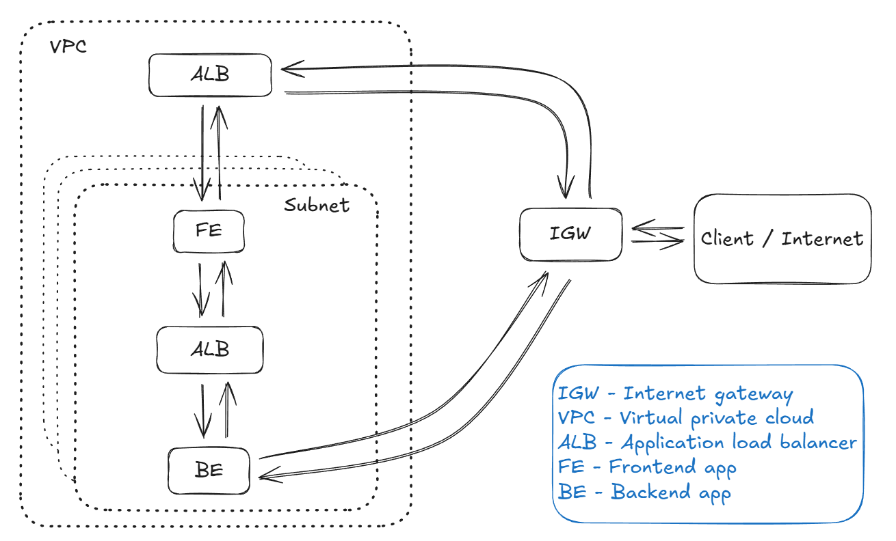

## Description

Frontend application built with NextJS.

Works with [backend app](https://github.com/ricenzca/caas-be).

## Cloud architecture



## Project setup

### Docker

1. Clone repo and create .env file in the repo root directory with the following:

```
BASE_URI=http://host.docker.internal:{backend-app-port}
HOSTNAME=0.0.0.0
```

2. Build docker image

```bash
docker build --build-arg NEXT_PUBLIC_BASE_URI=http://localhost:4000 -t caas-frontend:1 .
```

3. Create and run docker container using image

```bash
docker run -d --env-file .env -p 4000:4000 --name=caas-fe caas-frontend:1
```

4. Access application at `http://localhost:4000`

### pnpm (or npm)

1. Clone repo and create .env file in the repo root directory with the following:

```
BASE_URI=http://localhost:{backend-app-port}
NEXT_PUBLIC_BASE_URI=http://localhost:4000
```

2. Install dependencies

```bash
pnpm install
```

3. Run the project locally

```bash
pnpm run dev --port 4000
```

4. Access application at `http://localhost:4000`
